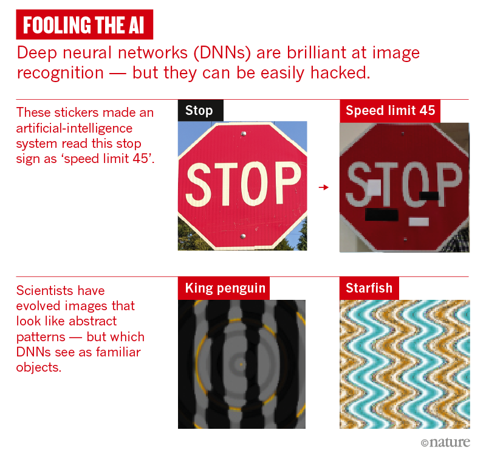

# Adversarial attacks Implementing a blackbox attack
## Why deep learning AIs are so easy to fool
A self-driving car approaches a stop sign, but instead of slowing down, it accelerates into the busy intersection. An accident report later reveals that four small rectangles had been stuck to the face of the sign. These fooled the car’s onboard artificial intelligence (AI) into misreading the word ‘stop’ as ‘speed limit 45’.

Such an event hasn’t actually happened, but the potential for sabotaging AI is very real. Researchers have already demonstrated how to fool an AI system into misreading a stop sign, by carefully positioning stickers on it1. They have deceived facial-recognition systems by sticking a printed pattern on glasses or hats. And they have tricked speech-recognition systems into hearing phantom phrases by inserting patterns of white noise in the audio.

These are just some examples of how easy it is to break the leading pattern-recognition technology in AI, known as deep neural networks (DNNs). These have proved incredibly successful at correctly classifying all kinds of input, including images, speech and data on consumer preferences. They are part of daily life, running everything from automated telephone systems to user recommendations on the streaming service Netflix. Yet making alterations to inputs — in the form of tiny changes that are typically imperceptible to humans — can flummox the best neural networks around.

## Intriguing Properties of Neural Nets
Deep neural networks are highly expressive models that have recently achieved state of the art performance on speech and visual recognition tasks. While their expressiveness is the reason they succeed, it also causes them to learn uninterpretable solutions that could have counter-intuitive properties. In this paper we report two such properties.

- First, we find that there is no distinction between individual high level units and random linear combinations of high level units, according to various methods of unit analysis. It suggests that it is the space, rather than the individual units, that contains of the semantic information in the high layers of neural networks.

- Second, we find that deep neural networks learn input-output mappings that are fairly discontinuous to a significant extend. We can cause the network to misclassify an image by applying a certain imperceptible perturbation, which is found by maximizing the network's prediction error. In addition, the specific nature of these perturbations is not a random artifact of learning: the same perturbation can cause a different network, that was trained on a different subset of the dataset, to misclassify the same input.

## Explaining and Harnessing Adversarial Examples
Several machine learning models, including neural networks, consistently misclassify adversarial examples---inputs formed by applying small but intentionally worst-case perturbations to examples from the dataset, such that the perturbed input results in the model outputting an incorrect answer with high confidence. Early attempts at explaining this phenomenon focused on nonlinearity and overfitting. We argue instead that the primary cause of neural networks' vulnerability to adversarial perturbation is their linear nature. This explanation is supported by new quantitative results while giving the first explanation of the most intriguing fact about them: their generalization across architectures and training sets. Moreover, this view yields a simple and fast method of generating adversarial examples. 

## Adversarial examples in the physical world
Most existing machine learning classifiers are highly vulnerable to adversarial examples. An adversarial example is a sample of input data which has been modified very slightly in a way that is intended to cause a machine learning classifier to misclassify it. In many cases, these modifications can be so subtle that a human observer does not even notice the modification at all, yet the classifier still makes a mistake. Adversarial examples pose security concerns because they could be used to perform an attack on machine learning systems, even if the adversary has no access to the underlying model. Up to now, all previous work have assumed a threat model in which the adversary can feed data directly into the machine learning classifier. This is not always the case for systems operating in the physical world, for example those which are using signals from cameras and other sensors as an input.

## Adversarial Sample Transferablility 
Adversarial sample transferability is the property that some adversarial samples produced to mislead a specific model f can mislead other models f' —even if their architectures greatly differ. A practical impact of this property is that it leads to oracle-based black box attacks. In one such attack, Papernot et al. trained a local deep neural network (DNN) using crafted inputs and output labels generated by the target “victim” DNN. Thereafter, the local network was used to generate adversarial samples that were highly effective on the original victim DNN. The key here was that the adversary has very limited information. They knew nothing about the architecture or parameters but only knew that the victim was a DNN—and had only oracle access that allowed it to obtain outputs for chosen inputs.

## Blackbox Adversarial Attacks
With only the mild assumption of continuous-valued confidence scores, my highly query-efficient algorithm utilizes the following simple iterative principle: we randomly sample a vector from a predefined orthonormal basis and either add or subtract it to the target image. Despite its simplicity, the proposed method can be used for both untargeted and targeted attacks -- resulting in previously unprecedented query efficiency in both settings
